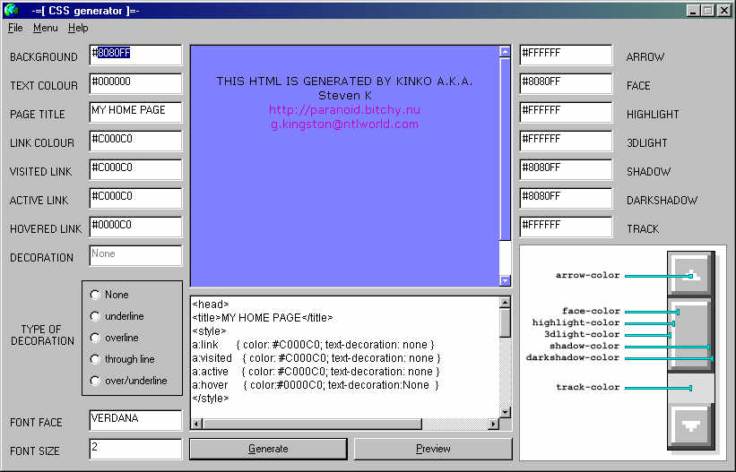



## CSS Gen

### Description

Generates CSS code for your website.

Generates scrollbars

generates links

and generates a general page

pretty much self explanitary
 
### More Info
 
if you edit the text in the large textbox down the bottom you need to click "Preview" not "Generate" as clicking generate will compile a new page from all the data boxes.

             |
---                |---
**Submitted On**   |2002-09-17 21:04:16
**By**             |[Steven Kinko](https://github.com/Planet-Source-Code/PSCIndex/blob/master/ByAuthor/steven-kinko.md)
**Level**          |Intermediate
**User Rating**    |5.0 (10 globes from 2 users)
**Compatibility**  |VB 6\.0
**Category**       |[Internet/ HTML](https://github.com/Planet-Source-Code/PSCIndex/blob/master/ByCategory/internet-html__1-34.md)
**World**          |[Visual Basic](https://github.com/Planet-Source-Code/PSCIndex/blob/master/ByWorld/visual-basic.md)
**Archive File**   |[CSS\_Gen1491771142002\.zip](https://github.com/Planet-Source-Code/steven-kinko-css-gen__1-40400/archive/master.zip)

